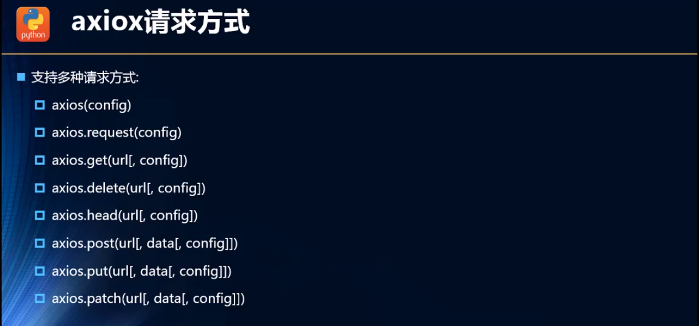

# axios

## 安装与基本配置

```bash
npm install axios --save
```


## 基本使用 get 与 post

```js
import axios from 'axios'

// 不带参数的get请求
axios({
    url: 'http://123.207.32.32:8000/home/multidata',
    method: 'get'  // 默认也是GET请求
}).then( res => console.log(res) );

// 带参数的get请求
axios.get('http://123.207.32.32:8000/home/data', {
    params: {
        type: 'pop',
        page: 1
    }
}).then( res => console.log(res));

axios.post(url: String, data: Object, config: Object).then(...)
```

> axios请求的结果都封装在一个promise内。


## 并发请求 axios.all

> 将包含多个请求的数组传给axios.all函数。

```javascript
import axios from 'axios'
const p1 = axios();
const p2 = axios();
// 多个promise的结果封装在一个数组内
axios.all([p1, p2]).then( results => {
    console.log('p1的结果：', results[0]);
    console.log('p2的结果：', results[1]);
});
// 使用解构语法处理结果
axios.all([p1, p2]).then( ([result1, result2]) => { // 解构出多个参数要用小括号括起来
    console.log('p1的结果：', result1);
    console.log('p2的结果：', result2);
});
// axios.spread返回新的函数
const handler = axios.spread( (result1, result2) => {
    console.log('p1的结果：', result1);
    console.log('p2的结果：', result2);   
});
axios.all([p1, p2]).then(handler);
```


## 响应组成

response由以下几部分信息组成

```json
{
  // 服务端返回的数据
  data: {},

  // 服务端返回的状态码
  status: 200,

  // 服务端返回的状态信息
  statusText: 'OK',

  // 响应头
  // 所有的响应头名称都是小写
  headers: {},

  // axios请求配置
  config: {},

  // 请求
  request: {}
}  
```

用`then`接收以下响应信息：

```javascript
axios.get('/user/12345')
  .then(function(response) {
    console.log(response.data);
    console.log(response.status);
    console.log(response.statusText);
    console.log(response.headers);
    console.log(response.config);
  });
```


## 全局配置

**axios的全局配置包括配置axios.default和axios.defaults两个成员。**

**axios.default.defaults === axios.defaults 结果为true，即存在一层代理。**

> axios.default中主要是存在拦截器属性axios.default.interceptors，在需要时使用use添加中间件。
>
> axios.defaults中主要配置baseURL、timeout等其他常用的基本配置。

```javascript
import axios from 'axios'
axios.defaults.baseURL = 'https://api.example.com';
axios.defaults.headers.common['Authorization'] = AUTH_TOKEN;
axios.defaults.headers.post['Content-Type'] = 'application/x-www-form-urlencoded';

// 请求拦截器
axios.default.interceptors.request.use(config => {
    /* 进行处理...*/ 
    return config; // 这里类似于promise.then回调函数的返回情况。
}, err => {
    /* 处理错误...*/
    return Promise.reject(err); ⭐//这里很重要，如果这里不返回reject的promise或抛出异常，则会转为									 //resolved的promise，进入then的回调。 
});

// 响应拦截器
axios.default.interceptors.response.use(res => {
    /* 进行处理 ...*/
    return res; // 也可以直接返回 res.data。
}, err => {
    /* 处理错误...*/
    return Promise.reject(err);
})

```

例：

```javascript
import axios from 'axios'
axios.defaults.baseURL = 'http://127.0.0.1:8080';
let data = {
  user: 'xxx',
  password: '******'
};
axios.post('/abc', data)
	.then(res => console.log(res)); // 相当于给 http://127.0.0.1:8080/abc发送了post请求。
```


## 常用配置项

```json
{
    ⭐// `url`是将用于请求的服务器URL
    url: '/user',
    

    ⭐// `method`是发出请求时使用的请求方法
    method: 'get', // 默认

    
    ⭐// `baseURL`将被添加到`url`前面，除非`url`是绝对的。
    // 可以方便地为 axios 的实例设置`baseURL`，以便将相对 URL 传递给该实例的方法。
    baseURL: 'https://some-domain.com/api/',

    
    // `transformRequest`允许在请求数据发送到服务器之前对其进行更改
    // 这只适用于请求方法'PUT'，'POST'和'PATCH'
    // 数组中的最后一个函数必须返回一个字符串，一个 ArrayBuffer或一个 Stream
    transformRequest: [function (data) {
    	// 做任何你想要的数据转换
    	return data;
    }],

    
    // `transformResponse`允许在 then / catch之前对响应数据进行更改
    transformResponse: [function (data) {
    	// Do whatever you want to transform the data
    	return data;
    }],

    
    ⭐// `headers`是要发送的自定义 headers
    headers: {'X-Requested-With': 'XMLHttpRequest'},

    
    ⭐// `params`是要与请求一起发送的URL参数
    // 必须是纯对象或URLSearchParams对象
    params: {
    	ID: 12345
    },

    
    // `paramsSerializer`是一个可选的函数，负责序列化`params`
    // (e.g. https://www.npmjs.com/package/qs, http://api.jquery.com/jquery.param/)
    paramsSerializer: function(params) {
    	return Qs.stringify(params, {arrayFormat: 'brackets'})
    },

    ⭐// `data`是要作为请求主体发送的数据
    // 仅适用于请求方法“PUT”，“POST”和“PATCH”
    // 当没有设置`transformRequest`时，必须是以下类型之一：
    // - string, plain object, ArrayBuffer, ArrayBufferView, URLSearchParams
    // - Browser only: FormData, File, Blob
    // - Node only: Stream
    data: {
    	firstName: 'Fred'
    },

    ⭐// `timeout`指定请求超时之前的毫秒数。
    // 如果请求的时间超过'timeout'，请求将被中止。
    timeout: 1000,

    // `withCredentials`指示是否跨站点访问控制请求
    // should be made using credentials
    withCredentials: false, // default

    // `adapter'允许自定义处理请求，这使得测试更容易。
    // 返回一个promise并提供一个有效的响应（参见[response docs]（＃response-api））
    adapter: function (config) {
    /* ... */
    },

    // `auth'表示应该使用 HTTP 基本认证，并提供凭据。
    // 这将设置一个`Authorization'头，覆盖任何现有的`Authorization'自定义头，使用`headers`设置。
    auth: {
    	username: 'janedoe',
    	password: 's00pers3cret'
    },

    // “responseType”表示服务器将响应的数据类型
    // 包括 'arraybuffer', 'blob', 'document', 'json', 'text', 'stream'
    responseType: 'json', // default

    //`xsrfCookieName`是要用作 xsrf 令牌的值的cookie的名称
    xsrfCookieName: 'XSRF-TOKEN', // default

    // `xsrfHeaderName`是携带xsrf令牌值的http头的名称
    xsrfHeaderName: 'X-XSRF-TOKEN', // default

    // `onUploadProgress`允许处理上传的进度事件
    onUploadProgress: function (progressEvent) {
    // 使用本地 progress 事件做任何你想要做的
    },

    // `onDownloadProgress`允许处理下载的进度事件
    onDownloadProgress: function (progressEvent) {
    // Do whatever you want with the native progress event
    },

    // `maxContentLength`定义允许的http响应内容的最大大小
    maxContentLength: 2000,

    // `validateStatus`定义是否解析或拒绝给定的promise
    // HTTP响应状态码。如果`validateStatus`返回`true`（或被设置为`null` promise将被解析;否则，promise将被
      // 拒绝。
    validateStatus: function (status) {
    return status >= 200 && status < 300; // default
    },

    // `maxRedirects`定义在node.js中要遵循的重定向的最大数量。
    // 如果设置为0，则不会遵循重定向。
    maxRedirects: 5, // 默认

    // `httpAgent`和`httpsAgent`用于定义在node.js中分别执行http和https请求时使用的自定义代理。
    // 允许配置类似`keepAlive`的选项，
    // 默认情况下不启用。
    httpAgent: new http.Agent({ keepAlive: true }),
    httpsAgent: new https.Agent({ keepAlive: true }),

    // 'proxy'定义代理服务器的主机名和端口
    // `auth`表示HTTP Basic auth应该用于连接到代理，并提供credentials。
    // 这将设置一个`Proxy-Authorization` header，覆盖任何使用`headers`设置的现有的`Proxy-Authorization` 自定义 headers。
    proxy: {
        host: '127.0.0.1',
        port: 9000,
        auth: : {
        	username: 'mikeymike',
        	password: 'rapunz3l'
        }
    },

    // “cancelToken”指定可用于取消请求的取消令牌
    // (see Cancellation section below for details)
    cancelToken: new CancelToken(function (cancel) {
    })
}
```


## axios实例

你可以创建一个拥有通用配置的axios实例。

**`axios.creat([config])`**

```javascript
let instance = axios.create({
  baseURL: 'https://some-domain.com/api/',
  timeout: 1000,
  headers: {'X-Custom-Header': 'foobar'}
});

// 可以通过实例的defaults属性修改初始化时的config的内容。
instance.defaults.timeout = 2000; // 重新配置config中的timeout为2000ms
```

也可以为实例配置自己的拦截器

```javascript
let instance = axios.create({
  baseURL: 'https://some-domain.com/api/',
  timeout: 1000,
  headers: {'X-Custom-Header': 'foobar'}
});
instance.interceptors.request.use( config => {}, err => {});
```


## 配置优先级

```javascript
// 创建一个实例，这时的超时时间为系统默认的 0
var instance = axios.create();

// 通过instance.defaults重新设置超时时间为2.5s，因为优先级比系统默认高
instance.defaults.timeout = 2500;

// 通过request config重新设置超时时间为5s，因为优先级比instance.defaults和系统默认都高
instance.get('/longRequest', {
  timeout: 5000
});
```

**配置项通过一定的规则合并，`request config` > `instance.defaults` > `系统默认`，优先级高的覆盖优先级低的。**


## 拦截器

你可以在`then`和`catch`之前拦截请求和响应。

```javascript
// 添加一个请求拦截器   
// ⭐ interceptors是axios.default的属性，全局axios也可以通过代理直接拿到该属性
axios.interceptors.request.use(function (config) {
    // Do something before request is sent
    return config;
  }, function (error) {
    // Do something with request error
    return Promise.reject(error);
  });

// 添加一个响应拦截器
axios.interceptors.response.use(function (response) {
    // Do something with response data
    return response;
  }, function (error) {
    // Do something with response error
    return Promise.reject(error);
  });
```

如果之后想移除拦截器你可以这么做：

```javascript
var myInterceptor = axios.interceptors.request.use(config => {/*..*/}, err => {/*...*/});
axios.interceptors.request.eject(myInterceptor);
```

你也可以为axios实例添加一个拦截器：

```javascript
var instance = axios.create();
instance.interceptors.request.use(config => {/*..*/}, err => {/*...*/});
instance.interceptors.response.use(res => {/*..*/}, err => {/*...*/});
```


## 错误处理

全局：

```javascript
axios.get('/user/12345')
  .catch(function (error) {
    if (error.response) {
      // 发送请求后，服务端返回的响应码不是 2xx   
      console.log(error.response.data);
      console.log(error.response.status);
      console.log(error.response.headers);
    } else if (error.request) {
      // 发送请求但是没有响应返回
      console.log(error.request);
    } else {
      // 其他错误
      console.log('Error', error.message);
    }
    console.log(error.config);
  });
```

实例：

```javascript
let instance = axios.create({
    baseURL: 'http://127.0.0.1:8080',
    timeout: 1500
});
let p = instance.get('/user/12346');
p.then(res => console.log(res))
  .catch(function (error) {
    if (error.response) {
      // 发送请求后，服务端返回的响应码不是 2xx   
      console.log(error.response.data);
      console.log(error.response.status);
      console.log(error.response.headers);
    } else if (error.request) {
      // 发送请求但是没有响应返回
      console.log(error.request);
    } else {
      // 其他错误
      console.log('Error', error.message);
    }
    console.log(error.config);
  });
```

你可以用`validateStatus`定义一个http状态码返回的范围.

```javascript
axios.get('/user/12345', {
  validateStatus: function (status) {
    return status < 500; // Reject only if the status code is greater than or equal to 500
  }
})
```

## 取消请求

你可以通过`cancel token`来取消一个请求：

> The axios cancel token API is based on the withdrawn [cancelable promises proposal](https://link.jianshu.com/?t=https%3A%2F%2Fgithub.com%2Ftc39%2Fproposal-cancelable-promises).

You can create a cancel token using the `CancelToken.source` factory as shown below:

```javascript
var CancelToken = axios.CancelToken;
var source = CancelToken.source();

axios.get('/user/12345', {
  cancelToken: source.token
}).catch(function(thrown) {
  if (axios.isCancel(thrown)) {
    console.log('Request canceled', thrown.message);
  } else {
    // handle error
  }
});

// cancel the request (the message parameter is optional)
source.cancel('Operation canceled by the user.');
```

You can also create a cancel token by passing an executor function to the `CancelToken` constructor:

```javascript
var CancelToken = axios.CancelToken;
var cancel;

axios.get('/user/12345', {
  cancelToken: new CancelToken(function executor(c) {
    // An executor function receives a cancel function as a parameter
    cancel = c;
  })
});

// cancel the request
cancel();
```

> Note: you can cancel several requests with the same cancel token.